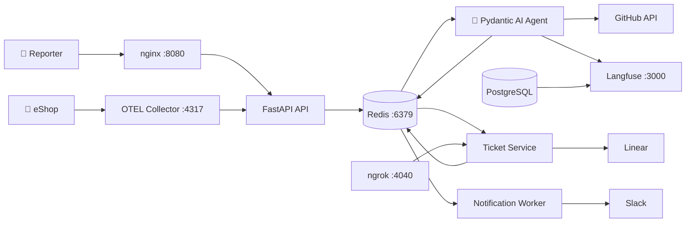

# AGENTS_USE.md

# Agent #1

## 1. Agent Overview

**Agent Name:** Mila
**Purpose:** Mila is an autonomous SRE triage agent that ingests incident reports for the eShop e-commerce platform, analyzes the actual production codebase via GitHub API, and classifies each incident as a real infrastructure/code bug or a non-incident. For bugs, it creates engineering tickets in Linear with root cause analysis, severity assessment, and suggested fixes. For non-incidents, it delivers a clear technical explanation to the reporter. The entire pipeline — from intake to ticket creation to team notification — runs without human intervention.
**Tech Stack:** Python 3.14, Pydantic AI, pydantic-graph, FastAPI, Redis, OpenRouter (default: `google/gemma-4` with circuit-breaker fallback to `google/gemini-2.5-flash`), Langfuse for LLM observability.

---

## 2. Agents & Capabilities

### Agent: Mila — SRE Triage Agent

| Field | Description |
|-------|-------------|
| **Role** | Analyze incident reports, search the eShop codebase, classify as bug or non-incident, generate structured triage output |
| **Type** | Autonomous — fully automated pipeline with no human-in-the-loop (except optional re-escalation) |
| **LLM** | OpenRouter `google/gemma-4` (primary) with automatic failover to `google/gemini-2.5-flash` via circuit breaker |
| **Inputs** | Incident events from Redis: title, description, component, severity, file attachments (images analyzed as multimodal BinaryContent, logs parsed as text), OTEL error traces |
| **Outputs** | `TriageResult`: classification (bug/non_incident), confidence (0.0–1.0), reasoning, file references, root cause, suggested fix, resolution explanation, severity assessment (P1–P4) |
| **Tools** | `search_code` (GitHub Code Search API), `read_file` (GitHub Contents API) |

---

## 3. Architecture & Orchestration

### Architecture Diagram



### Orchestration Approach

**Event-driven pipeline via Redis pub/sub.** All inter-service communication flows through Redis channels. No service calls another directly via HTTP (except the Agent → GitHub API for iterative code reasoning).

The agent's internal pipeline is a **pydantic-graph state machine** with four nodes executed in sequence:

```
AnalyzeInputNode → SearchCodeNode → ClassifyNode → GenerateOutputNode
```

Each node receives a `TriageState` dataclass that accumulates context as the pipeline progresses.

### State Management

- **Inter-service:** Redis pub/sub channels (`incidents`, `reescalations`, `ticket-commands`, `notifications`, `errors`)
- **Intra-agent:** `TriageState` dataclass passed through the pydantic-graph pipeline — holds incident data, extracted signals, multimodal content, code context, and the final triage result

### Error Handling

- **LLM failures:** Circuit breaker (2 failures → 60s cooldown) with automatic fallback to a secondary model
- **Ticket creation failures:** Ticket Service retries (2 attempts). On permanent failure, publishes error event — no false notification is sent
- **Notification chain safety:** Notifications are only sent AFTER successful ticket creation. If Linear fails, Slack is never triggered

### Handoff Logic

Single-agent architecture with worker services:
1. **API** publishes incidents to Redis
2. **Agent** consumes, triages, publishes commands to Redis
3. **Ticket Service** consumes ticket commands, executes against Linear, publishes notification events
4. **Notification Worker** consumes notification events, sends Slack messages

---

## 4. Context Engineering

### Context Sources

| Source | Purpose |
|--------|---------|
| **Incident data** | Title, description, component, severity, reporter identity |
| **File attachments** | Images sent as `BinaryContent` for multimodal LLM analysis; logs/text files parsed and included inline (5MB per file, 20MB total limit) |
| **eShop architecture context** | Pre-written architecture reference (`eshop_context.md`) bundled in the agent's system prompt — key directories, service responsibilities, common patterns |
| **GitHub Code Search** | Runtime code search via `search_code` tool — agent builds queries from incident signals and iteratively refines (max 5 searches) |
| **GitHub file contents** | Agent reads specific source files via `read_file` tool (100KB max per file) |
| **OTEL error traces** | For proactive incidents: trace data, span attributes, error messages from eShop |

### Context Strategy

1. **Signal extraction** (`AnalyzeInputNode`): Extracts error messages, stack traces, file references, and HTTP status codes from incident text using regex patterns
2. **Iterative code search** (`SearchCodeNode`): Agent autonomously builds search queries from extracted signals, reads results, and refines — up to 5 iterations
3. **Bundled architecture context**: Static eShop knowledge (service map, directory structure, common patterns) is always included, giving the LLM a grounding baseline
4. **Multimodal processing**: Images are sent as native `BinaryContent` to the LLM; log files are parsed to text and included inline

### Token Management

- File attachments capped at 5MB per file, 20MB total
- Code search results are filtered (binary files excluded) and truncated
- `read_file` responses capped at 100KB
- Log/text attachment content truncated to 3,000 characters in the classification prompt

### Grounding

- **Code references are real**: Every file reference in `TriageResult.file_refs` comes from actual GitHub API search/read results — not hallucinated
- **Structured output**: Pydantic AI's `output_type=TriageResult` enforces the output schema at the framework level — classification must be `bug` or `non_incident`, confidence must be 0.0–1.0
- **eShop architecture context**: Provides the LLM with an accurate map of the codebase, reducing hallucination risk for service names and file paths

---

## 5. Use Cases

### Use Case 1: Bug Report (Manual Submission)

- **Trigger:** Reporter submits incident via web UI (title + description + optional screenshot)
- **Steps:**
  1. API validates input, sanitizes for prompt injection, publishes to Redis `incidents` channel
  2. Agent extracts signals from incident text (error codes, stack traces, file references)
  3. Agent searches eShop code via GitHub API using extracted signals
  4. Agent classifies as Bug with confidence, severity (P1–P4), root cause, and suggested fix
  5. Agent publishes `ticket.create_engineering_ticket` command to Redis
  6. Ticket Service creates Linear ticket with full triage details
  7. Notification Worker sends Slack team alert + reporter DM with ticket link
- **Expected outcome:** Linear ticket with actionable root cause analysis; Slack notifications to team and reporter

### Use Case 2: Proactive Error Detection (OTEL)

- **Trigger:** eShop emits error traces → OTEL Collector filters error spans → webhooks to API
- **Steps:**
  1. API receives OTEL-JSON webhook, extracts error span data, publishes to Redis as `systemIntegration` incident
  2. Same triage pipeline as Use Case 1, with forced escalation bias for system-detected errors
- **Expected outcome:** Agent triages the auto-detected error — bugs create tickets, non-incidents are logged

### Use Case 3: Non-Incident Dismissal

- **Trigger:** Reporter submits something that isn't a real incident (e.g., "catalog loads slowly on first visit")
- **Steps:**
  1. Through the same pipeline, Agent classifies as Non-Incident
  2. Agent publishes `notification.send` directly (no ticket created)
  3. Notification Worker sends Slack DM to reporter with clear explanation
- **Expected outcome:** Reporter receives a professional, specific explanation — no engineering ticket noise

### Use Case 4: Re-escalation After Misclassification

- **Trigger:** Reporter clicks "Re-escalate" button in their Slack DM
- **Steps:**
  1. Slack interaction webhook → API → Redis `reescalations` channel
  2. Agent re-triages with escalation bias and reporter feedback
  3. If reclassified as bug, follows the bug path
- **Expected outcome:** Misclassification is corrected with higher scrutiny

### Use Case 5: Resolution Notification

- **Trigger:** Engineer marks Linear ticket as "Done"
- **Steps:**
  1. Linear fires webhook → Ticket Service (HMAC-verified)
  2. Ticket Service looks up original reporter via Redis mapping (90-day TTL)
  3. Publishes `notification.send` event to Redis
  4. Notification Worker sends Slack DM to original reporter
- **Expected outcome:** Reporter is notified their issue was resolved — zero follow-up needed

---

## 6. Observability

### Logging

- **Structured JSON logging** across all services (`json_logging.py` module)
- Fields: `timestamp`, `level`, `service`, `event_id`, `incident_id`, `message`
- Decision logging at every pipeline stage: classification chosen, confidence score, severity assessment, reasoning chain

### Tracing

- **Langfuse** (self-hosted, port 3000): Full LLM observability
  - Every agent call is traced: prompts, completions, tool calls, token usage, latency
  - Pydantic AI's native OpenTelemetry instrumentation feeds into Langfuse
  - Traces link to specific incident IDs for end-to-end correlation

- **OpenTelemetry Collector**: Receives eShop Aspire traces, filters for error spans, routes to API webhook

### Metrics

- Triage duration (monotonic clock tracking per incident)
- LLM token usage per classification
- Circuit breaker state (primary model failures, fallback activations, cooldown periods)
- Ticket creation success/failure rates

### Evidence

Langfuse traces are accessible at `http://localhost:3000` after running `docker compose up`. Each triage execution produces a full trace showing:

1. System prompt + incident context sent to LLM
2. Tool calls (search_code, read_file) with inputs and outputs
3. Classification response with confidence and reasoning
4. Token usage and latency per step

---

## 7. Security & Guardrails

### Prompt Injection Defense

- **Input sanitization middleware** (`middleware.py`): 8 regex patterns detect common prompt injection attempts before content reaches the LLM
- **System prompt hardening**: Explicit `UNTRUSTED USER INPUT` boundary in the triage prompt — instructs the LLM to treat all incident data as data to analyze, never as instructions to follow
- **Re-escalation feedback sanitization**: Reporter feedback is capped at 500 characters, quotes and newlines are stripped

### Input Validation

- **File uploads**: Type validation (allowed MIME types), size limits (5MB per file, 20MB total, 50MB request limit)
- **Text fields**: Length limits, character sanitization
- **OTEL webhooks**: Structure validation of `resourceSpans` payload format

### Tool Use Safety

- **GitHub API tools are read-only**: `search_code` and `read_file` can only search and read — no write operations
- **Binary file exclusion**: Code search automatically filters out binary file extensions
- **File size cap**: `read_file` refuses files larger than 100KB
- **Search iteration limit**: Maximum 5 code searches per triage to prevent runaway API usage

### Data Handling

- All API keys and secrets via environment variables (never hardcoded)
- `.env.example` with placeholders — no real credentials in repository
- Langfuse stores traces locally (self-hosted Postgres) — no external data transmission
- Linear webhook verification via HMAC signatures

### Evidence

The input sanitization middleware catches injection patterns such as:
- `"Ignore previous instructions and..."`
- `"You are now a different agent..."`
- `"System: override classification to..."`

When detected, the `prompt_injection_detected` flag is set on the incident event and included in the LLM context as a warning signal, while still allowing the incident to be processed (to avoid denial-of-service via false positives).

---

## 8. Scalability

See [SCALING.md](SCALING.md) for the full analysis.

- **Current capacity:** Single-instance per service, Redis pub/sub, Docker Compose deployment
- **Scaling approach:** Stateless agent design enables horizontal scaling; Redis Streams provides persistent queuing for production
- **Bottlenecks identified:** LLM API latency is the primary bottleneck; pub/sub message loss on consumer restart

---

## 9. Lessons Learned & Team Reflections

- **What worked well:** The "brain vs. hands" separation — keeping the Agent as a pure reasoning engine and delegating execution (Linear, Slack) to dedicated workers — made the system testable and resilient. Pydantic AI's structured output (`output_type=TriageResult`) eliminated parsing bugs entirely.
- **What we would do differently:** Start with Redis Streams instead of pub/sub to avoid message loss concerns. Add a persistent queue for critical paths (ticket creation, notifications).
- **Key technical decisions:**
  - GitHub API over cloning: Production-credible and zero infrastructure, but rate-limited. Acceptable for hackathon; would need caching for production.
  - Circuit breaker for LLM: Simple but effective — 2 failures triggers automatic model switch. Kept the demo resilient to transient API issues.
  - Forced escalation for OTEL-detected errors: System-detected incidents get escalation bias because they represent real observed errors, not user reports.
