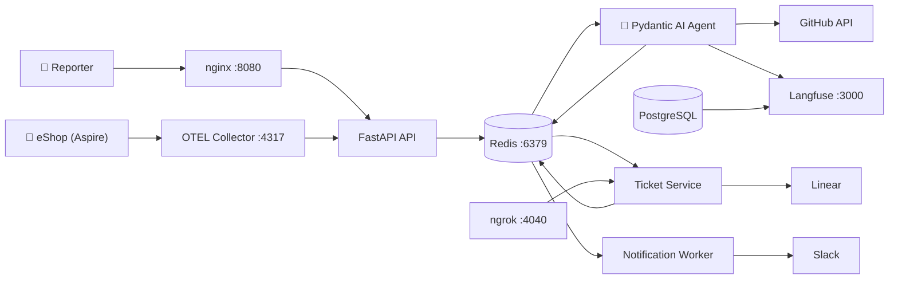

# mila — AI SRE Incident Intake & Triage Agent

**mila** is an AI-powered SRE agent that automates incident intake, triage, and routing for the [eShop](https://github.com/dotnet/eShop) e-commerce platform. It ingests incident reports (text + images + logs), analyzes the actual production codebase via GitHub API, classifies incidents as real bugs or non-incidents, creates engineering tickets in Linear, notifies teams via Slack, and closes the loop when issues are resolved — fully autonomously.

Built for the **AgentX Hackathon 2026** by SoftServe.

## Architecture



### How It Works

1. **Incident Intake** — Reporters submit incidents via the web UI (text + file attachments) or eShop errors are auto-detected via OTEL Collector
2. **Event Bus** — The API publishes events to Redis; the Agent consumes them
3. **AI Triage** — The Agent runs a pydantic-graph pipeline: analyze input → search code → classify → generate output
4. **Ticket Creation** — For real bugs, the Agent publishes a command; the Ticket Service creates a Linear ticket with root cause, severity, and suggested fix
5. **Team Notification** — The Notification Worker sends Slack alerts to the team channel and DMs the reporter
6. **Resolution Loop** — When an engineer resolves the Linear ticket, a webhook triggers a Slack DM to the original reporter

## Tech Stack

| Layer | Technology |
|---|---|
| **Language** | Python 3.14 |
| **Agent Framework** | Pydantic AI + pydantic-graph |
| **API** | FastAPI + Uvicorn |
| **LLM** | OpenRouter (default: `google/gemma-4`) with automatic fallback via circuit breaker |
| **Ticketing** | Linear (GraphQL API + webhooks) |
| **Notifications** | Slack (Bot API + Block Kit) |
| **Code Analysis** | GitHub API (Code Search + Contents) |
| **Message Bus** | Redis (pub/sub) |
| **Observability** | OpenTelemetry + Langfuse (self-hosted) |
| **UI** | Static HTML served by nginx |
| **Deployment** | Docker Compose (10 services) |

## Setup

### Prerequisites

- **Docker** and **Docker Compose** installed
- API keys for: OpenRouter (or Anthropic), Linear, Slack, GitHub
- Optional: Langfuse cloud account or use self-hosted (included)

### Configuration

1. Clone the repository:
   ```bash
   git clone <repository-url>
   cd mila
   ```

2. Copy and configure environment variables:
   ```bash
   cp .env.example .env
   ```

3. Fill in your API keys in `.env`:
   | Variable | Required | Description |
   |---|---|---|
   | `LLM_MODEL` | Yes | Model string, e.g. `openrouter:google/gemma-4` |
   | `OPENROUTER_API_KEY` | Yes | OpenRouter API key |
   | `LINEAR_API_KEY` | Yes | Linear API key |
   | `LINEAR_TEAM_ID` | Yes | Linear team ID for ticket creation |
   | `LINEAR_WEBHOOK_SECRET` | Yes | Secret for verifying Linear webhooks |
   | `SLACK_BOT_TOKEN` | Yes | Slack Bot OAuth token |
   | `SLACK_CHANNEL_ID` | Yes | Slack channel for team alerts |
   | `GITHUB_TOKEN` | Yes | GitHub PAT for code search |
   | `LANGFUSE_SECRET_KEY` | Yes | Langfuse secret key |
   | `LANGFUSE_PUBLIC_KEY` | Yes | Langfuse public key |

   > See `.env.example` for the full list of variables, including optional settings (fallback model, confidence thresholds, ngrok) that have sensible defaults.

4. Start all services:
   ```bash
   docker compose up --build
   ```

5. Access the UI at **http://localhost:8080**

## Demo Scenarios

### 1. Bug Path — Checkout Service 500 Errors

**Submit:** "Checkout service returning 500 errors after latest deployment. Users cannot complete purchases."

**Expected:** Agent analyzes eShop code → classifies as Bug (P1/P2) → creates Linear ticket with root cause and suggested fix → Slack team alert → reporter DM with ticket link.

### 2. Proactive Detection — OTEL Error Traces

**Trigger:** eShop emits error traces via OpenTelemetry → OTEL Collector filters errors → webhooks to API → same triage pipeline.

**Expected:** Agent triages the auto-detected error exactly like a manual report.

### 3. Non-Incident Path — Expected Behavior

**Submit:** "The catalog page takes 2 seconds to load on first visit."

**Expected:** Agent classifies as Non-Incident → no Linear ticket → Slack DM to reporter with technical explanation (e.g., cold start, cache warming).

### 4. Re-escalation — Misclassification

**Trigger:** Reporter receives a non-incident dismissal → clicks "Re-escalate" button in Slack → Agent re-analyzes with additional context.

**Expected:** Agent re-triages with higher scrutiny → may reclassify as bug if new evidence warrants it.

### 5. Resolution Notification

**Trigger:** Engineer marks the Linear ticket as "Done".

**Expected:** Linear webhook → Ticket Service → Notification Worker → Slack DM to original reporter confirming resolution.

## Project Structure

```
mila/
├── docker-compose.yml          # 10-service orchestration
├── .env.example                # Environment variable template
├── services/
│   ├── ui/                     # nginx + static HTML form
│   ├── api/                    # FastAPI — incident intake + webhooks
│   ├── agent/                  # Pydantic AI — triage graph pipeline
│   ├── ticket-service/         # Linear API integration worker
│   └── notification-worker/    # Slack notification worker
├── infra/
│   └── otel-collector-config.yaml
├── tests/                      # Unit + integration tests
├── docs/                       # PRD, architecture, stories
├── AGENTS_USE.md               # Agent documentation
├── SCALING.md                  # Scaling strategy
├── QUICKGUIDE.md               # Quick start guide
└── LICENSE                     # MIT
```

## Documentation

- [**QUICKGUIDE.md**](QUICKGUIDE.md) — 6-step quickstart
- [**AGENTS_USE.md**](AGENTS_USE.md) — Agent architecture, capabilities, and observability
- [**SCALING.md**](SCALING.md) — Scaling strategy and production hardening

## License

MIT — see [LICENSE](LICENSE).
