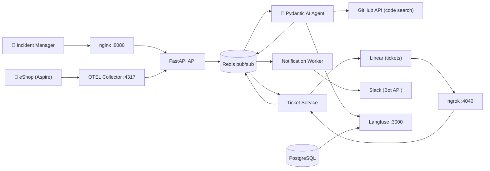

```markdown
# Mila — AI SRE Incident Intake & Triage Agent

Every technical team knows the feeling: alerts start firing, services behave unexpectedly, and the people who notice first are not always the ones who can fix it. By the time a real incident reaches the right engineer, critical context has been lost, time has been wasted, and in an e-commerce platform every minute of degraded service is a customer who couldn't check out.

Mila is an AI triage agent that brings SRE expertise to any team that needs it. When an incident is reported, Mila reads it, analyzes the relevant codebase, and makes a decision: resolve it on the spot or escalate it with everything an engineer needs to act immediately. What makes Mila different is that she doesn't just route reports, she reasons about them.

Built for the **AgentX Hackathon 2026** by SoftServe. Designed and implemented using the **BMAD methodology** (Business, Management, Architecture, Development) with structured epics, user stories, and acceptance criteria documented in `docs/planning-artifacts/` and `docs/implementation-artifacts/`.

---

## What Mila Does

Mila monitors the [eShop](https://github.com/dotnet/eShop) e-commerce platform from two directions: reactively, when an Incident Manager submits a report through the web UI, and proactively, when the OpenTelemetry Collector detects error spans in production without any human input.

Once an incident arrives, Mila runs a four-node AI pipeline that analyzes the report, searches the actual eShop codebase on GitHub, and makes a classification decision. If it is a real bug, she creates a fully contextualized Linear ticket with the root cause, affected files, and a suggested fix, then notifies the engineering team on Slack. If it is not a real incident, she responds directly to the reporter with an explanation. When the engineer closes the ticket, Mila closes the loop by notifying the original reporter.

**Key capabilities:**
- Multimodal input: text, images, and log files in a single report
- Real codebase analysis via GitHub API on every triage
- Autonomous proactive detection via OpenTelemetry with no human trigger
- Prompt injection detection and input sanitization before any LLM call
- Full observability with structured logs, distributed traces, and triage completion events
- End-to-end notification loop from intake to resolution

---

## Architecture



### Pipeline

1. **Incident Intake** — Incident Managers submit reports via the web UI with text, images, and log files. eShop errors are also auto-detected via the OTEL Collector without any human input.
2. **Signal Extraction** — The API sanitizes input, detects prompt injection attempts, and publishes the incident to Redis. The Agent extracts error signals, stack traces, and file references from all attachments.
3. **AI Triage** — The Agent runs a four-node pydantic-graph pipeline: `AnalyzeInput → SearchCode → Classify → GenerateOutput`. It searches the eShop codebase via GitHub API, reads relevant files, and classifies the incident as a real bug or a non-incident.
4. **Ticket Creation** — For real bugs, the Ticket Service creates a Linear ticket with root cause, affected files, severity, and suggested fix.
5. **Team Notification** — The Notification Worker sends a Slack alert to the engineering channel with a direct link to the ticket.
6. **Resolution Loop** — When an engineer resolves the Linear ticket, a webhook triggers a Slack DM to the original reporter confirming the incident is closed.

---

## Tech Stack

| Layer | Technology |
|---|---|
| **Language** | Python 3.14 |
| **Agent Framework** | Pydantic AI + pydantic-graph |
| **API** | FastAPI + Uvicorn |
| **LLM** | Configurable via `LLM_MODEL` (default: `openrouter:google/gemma-4`) with automatic circuit breaker fallback |
| **Ticketing** | Linear (GraphQL API + webhooks via ngrok) |
| **Notifications** | Slack (Bot API + Block Kit) |
| **Code Analysis** | GitHub API (Code Search + Contents) |
| **Message Bus** | Redis (pub/sub) |
| **Observability** | OpenTelemetry + Langfuse (self-hosted) |
| **UI** | Static HTML served by nginx |
| **Deployment** | Docker Compose (10 services) |

---

## Multimodal Input

Mila accepts incident reports combining multiple input types in a single submission:

| Type | Accepted formats |
|---|---|
| Text | Title and description fields |
| Images | `.png`, `.jpg`, `.jpeg`, `.gif`, `.webp`, `.bmp` |
| Log files | `.log`, `.txt`, `.csv`, `.json`, `.yaml`, `.yml` |

Images are passed directly to the multimodal LLM for visual analysis. Log files are read as text and their content is used to extract error signals that guide the codebase search.

---

## Guardrails & Security

**Prompt injection detection** — An API middleware scans all user-submitted text before it reaches the agent, detecting 8 known injection patterns including role reassignment, instruction overrides, and role switching. Detected attempts are flagged and the agent receives an additional caution addendum in its system prompt.

**Input sanitization** — All text fields are stripped of HTML tags, control characters, and excess whitespace before processing.

**Untrusted input handling** — The system prompt explicitly instructs the agent to treat all incident data as untrusted input to be analyzed, never as instructions to follow.

**Safe tool use** — File path traversal is prevented in attachment handling. GitHub API calls are read-only.

---

## Observability

**Structured JSON logs** — Every service emits JSON logs with `event_id`, `incident_id`, `service`, and `timestamp` fields, making it easy to trace a single incident across all services.

**Distributed tracing with Langfuse** — The Agent instruments all Pydantic AI nodes with OpenTelemetry spans exported to Langfuse. Each triage pipeline records classification, confidence, severity, source type, duration, and files examined.

**Proactive detection via OTEL Collector** — The OTel Collector receives spans from eShop via OTLP, filters for error-status spans only, and forwards them to Mila's API as proactive incident webhooks.

**Triage completion events** — Every triage publishes a `triage.completed` event to an observability channel with structured metadata for downstream monitoring.

Access the Langfuse dashboard at `http://localhost:3000` after starting the stack.

---

## Responsible AI

**Transparency** — Every triage decision includes a chain-of-thought reasoning field and a confidence score. Low-confidence classifications are flagged explicitly.

**Fairness** — Classification criteria are defined in the system prompt. Severity is assessed independently from reporter input, with any difference documented in the ticket.

**Accountability** — All triage decisions are logged with full metadata. Reporters can re-escalate any non-incident classification if they disagree.

**Privacy** — Raw user input is never included in observability events. Only metadata is emitted to the observability channel.

**Security** — Prompt injection detection, input sanitization, and read-only tool access are enforced at every stage.

---

## Setup

### Prerequisites

- Docker and Docker Compose installed
- API keys for: LLM provider, Linear, Slack, GitHub
- ngrok account (free tier) for Linear webhook delivery

### Configuration

1. Clone the repository:
   ```bash
   git clone <repository-url>
   cd mila-sre-incident-triage-agent
   ```

2. Copy the environment template:
   ```bash
   cp .env.example .env
   ```

3. Fill in your API keys in `.env`:

   | Variable | Description |
   |---|---|
   | `LLM_MODEL` | Model string, e.g. `openrouter:google/gemma-4` or `claude-haiku-4-5-20251001` |
   | `OPENROUTER_API_KEY` | OpenRouter API key (if using OpenRouter models) |
   | `ANTHROPIC_API_KEY` | Anthropic API key (if using Claude models) |
   | `LINEAR_API_KEY` | Linear personal API key |
   | `LINEAR_TEAM_ID` | Linear team ID for ticket creation |
   | `LINEAR_WEBHOOK_SECRET` | Secret for verifying Linear webhooks |
   | `SLACK_BOT_TOKEN` | Slack Bot OAuth token |
   | `SLACK_WEBHOOK_URL` | Slack incoming webhook URL for team channel |
   | `SLACK_CHANNEL_ID` | Slack channel ID for team alerts |
   | `GITHUB_TOKEN` | GitHub personal access token for code search |
   | `NGROK_AUTHTOKEN` | ngrok auth token for Linear webhook tunneling |
   | `LANGFUSE_PUBLIC_KEY` | Langfuse public key |
   | `LANGFUSE_SECRET_KEY` | Langfuse secret key |

   > See `.env.example` for the full list including optional variables with sensible defaults.

4. Start all services:
   ```bash
   docker compose up --build
   ```

5. Access the UI at **http://localhost:8080** and Langfuse at **http://localhost:3000**

---

## Project Structure

```
mila/
├── docker-compose.yml
├── .env.example
├── services/
│   ├── ui/                     # nginx + static HTML incident form
│   ├── api/                    # FastAPI — incident intake, sanitization, webhooks
│   ├── agent/                  # Pydantic AI — four-node triage graph pipeline
│   ├── ticket-service/         # Linear API integration + resolution webhook handler
│   └── notification-worker/    # Slack Bot API notification worker
├── infra/
│   └── otel-collector-config.yaml
├── tests/
├── docs/
├── AGENTS_USE.md
├── SCALING.md
├── QUICKGUIDE.md
└── LICENSE
```

---

## Documentation

- [**QUICKGUIDE.md**](QUICKGUIDE.md) — Step-by-step quickstart
- [**AGENTS_USE.md**](AGENTS_USE.md) — Agent architecture, capabilities, and observability evidence
- [**SCALING.md**](SCALING.md) — Scaling strategy and production hardening

---

## License

MIT — see [LICENSE](LICENSE).
```