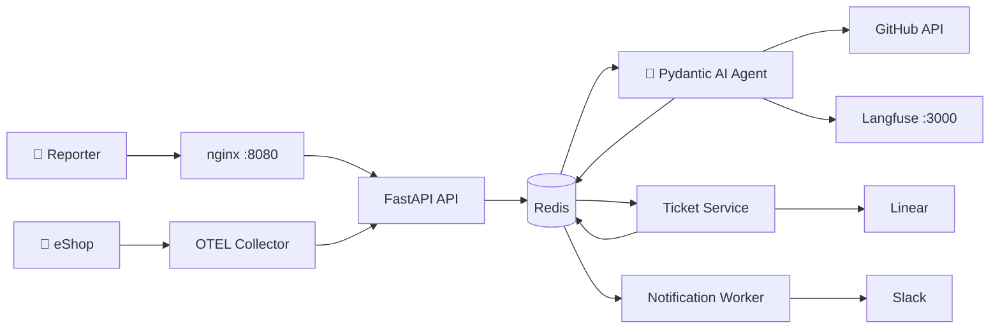

# Story 7.3: Repository Documentation

> **Epic:** 7 — Deployment, Integration & Documentation
> **Status:** ready-for-dev
> **Priority:** 🟠 High — Hackathon deliverable
> **Depends on:** Story 7.2 (E2E validated — docs should reflect actual implementation)
> **FRs:** FR36, FR37, FR38, FR39, FR42

## Story

**As a** hackathon evaluator,
**I want** clear documentation that explains the architecture, how to set up the project, and how agents are used,
**So that** I can evaluate the project's technical quality and reproduce the demo.

## Acceptance Criteria

**Given** the repository root
**When** the evaluator checks for required files
**Then** the following files exist with complete content:

**README.md** contains:
- Project summary (what mila does)
- Architecture diagram (mermaid or image) showing services, Redis bus, Linear, Slack, OTEL
- Tech stack summary
- Setup instructions (prerequisites, env vars, docker compose)
- Demo scenarios (bug path, proactive path, non-incident path, re-escalation)

**AGENTS_USE.md** contains:
- Agent description and capabilities
- How the triage pipeline works (pydantic-graph nodes, classification, confidence, severity)
- Tool usage (search_code, read_file via GitHub API)
- Advanced agent intelligence: confidence-based decisions, severity analysis, re-escalation handling
- Observability evidence (Langfuse traces)
- Safety measures (input sanitization, prompt hardening, untrusted-input boundary)
- Responsible AI alignment

**SCALING.md** contains:
- Current architecture constraints
- Horizontal scaling strategy (stateless agent, Redis pub/sub → streams)
- Multi-codebase support path
- Production hardening considerations

**QUICKGUIDE.md** contains:
- Step 1: Clone repository
- Step 2: Copy `.env.example` to `.env`, fill in API keys
- Step 3: `docker compose up --build`
- Step 4: Open `http://localhost:8080` to submit an incident
- Step 5: Check Linear for tickets, Slack for alerts and DMs
- Step 6: Open `http://localhost:3000` for Langfuse traces

**LICENSE** — MIT (already exists)

## Tasks / Subtasks

- [ ] **1. Create README.md**
  - Project summary: mila = AI SRE Incident Intake & Triage Agent for eShop
  - Architecture diagram (Mermaid): services, Redis bus, Linear, Slack, OTEL, Langfuse
  - Tech stack table: Python 3.12+, FastAPI, Pydantic AI, pydantic-graph, Redis, Docker
  - Setup instructions: prerequisites (Docker, API keys), env var config, startup
  - Demo walkthrough: 5 scenarios with expected results

- [ ] **2. Create AGENTS_USE.md**
  - Agent architecture: Pydantic AI + pydantic-graph state machine
  - Triage pipeline: analyze_input → search_code → classify → generate_output
  - Tool descriptions: search_code (GitHub Code Search), read_file (GitHub Contents)
  - Structured output: TriageResult model with classification, confidence, reasoning, severity
  - Intelligence features: confidence thresholds, severity analysis with delta explanation, re-escalation
  - Safety: input sanitization, prompt injection detection, untrusted-input boundary in system prompt
  - Langfuse traces as observability evidence

- [ ] **3. Create SCALING.md**
  - Current: single-instance per service, Redis pub/sub, Docker Compose
  - Scaling path: stateless agent → horizontal scaling, Redis Streams for persistent queuing
  - Multi-codebase: parameterize GitHub repo, add codebase context per project
  - Production: replace pub/sub with Streams, add persistence, add API authentication, production Langfuse

- [ ] **4. Create QUICKGUIDE.md**
  - 6-step quickstart (clone → env → build → browse → check → trace)
  - Clear, copy-pasteable commands
  - Expected outputs at each step

- [ ] **5. Verify LICENSE exists**
  - MIT license already in repo root — confirm it's present and correct

## Dev Notes

### Architecture Guardrails
- **Documentation should reflect actual implementation.** Write docs AFTER E2E validation (Story 7.2).
- **Concise and evaluator-focused.** Hackathon judges have limited time — prioritize clarity over completeness.
- **Architecture diagram should match reality.** Update if implementation diverged from the original architecture doc.

### Mermaid Architecture Diagram (Draft)

### Key Reference Files
- PRD: `docs/planning-artifacts/prd.md` — project summary, success criteria
- Architecture: `docs/planning-artifacts/architecture.md` — technical details
- Hackathon doc: `docs/agent-x-hackathon-2026.md` — deliverable requirements

## Chat Command Log

*Dev agent: record your implementation commands and decisions here.*
